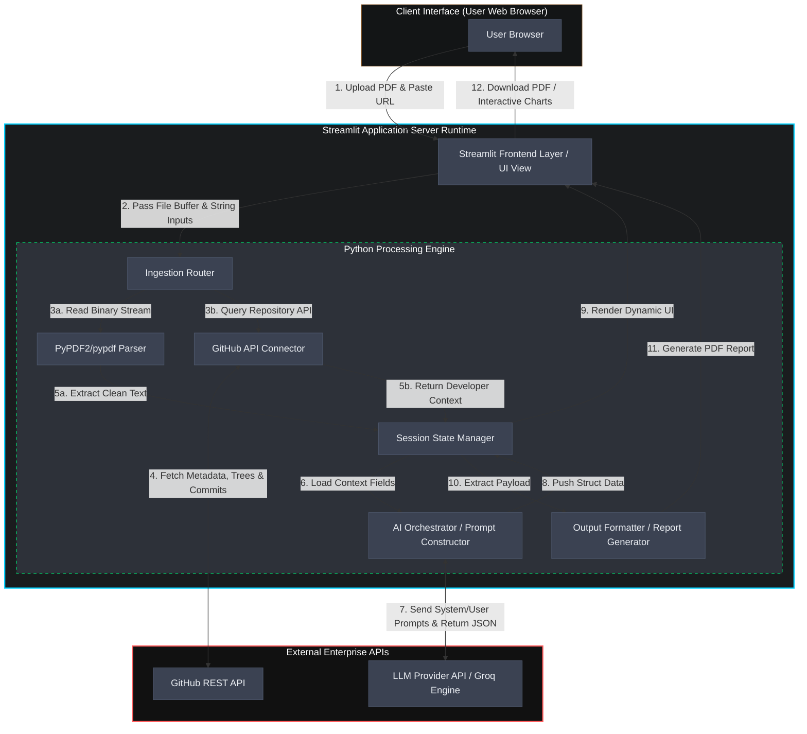
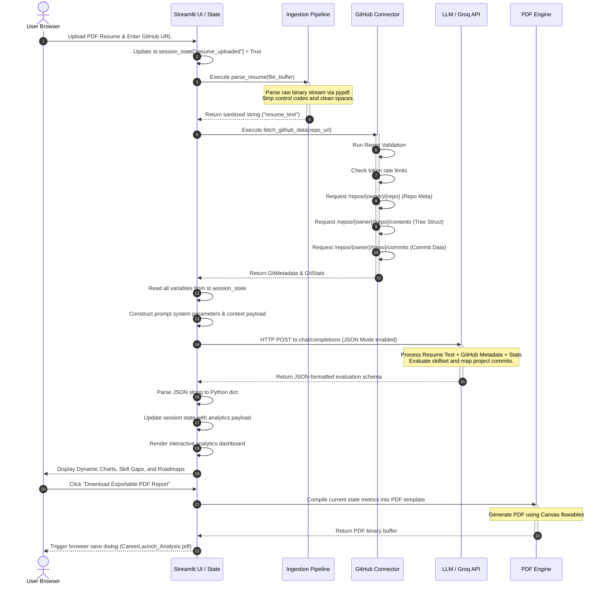

# CareerLaunch AI: System Architecture & Data Flow Specification
**Author:** Principal Solutions Architect  
**Target Audience:** Enterprise Engineering Judges, Lead Developers, Senior Systems Engineers  
**Classification:** Technical Architecture Document (Production-Grade)

---

## SECTION 1: SYSTEM OVERVIEW & ARCHITECTURE STYLE

### 1.1 The Streamlit Single-Instance Architecture Model
CareerLaunch AI utilizes a **Streamlit Single-Instance Architecture** model. Unlike traditional multi-tier web applications that decouple the presentation layer (e.g., React, Vue) from the business logic layer (e.g., Node.js, FastAPI) via network boundaries, Streamlit unifies the user interface rendering engine and the Python execution runtime into a single operating system process. 

```
┌────────────────────────────────────────────────────────────────────────┐
│                        SINGLE PROCESS RUNTIME                          │
│                                                                        │
│  ┌────────────────────────┐            ┌────────────────────────────┐  │
│  │   Streamlit Frontend   │            │   Python Backend Engine    │  │
│  │   Rendering Engine     │◄──────────►│   (State, Pipelines, APIs) │  │
│  └────────────────────────┘            └────────────────────────────┘  │
└────────────────────────────────────────────────────────────────────────┘
```

Despite executing in a unified thread space, the application maintains a strict logical separation of concerns. This is achieved by dividing the codebase into modular, decoupled modules:
*   **UI/Presentation Layer (`app.py` / `views/`):** Consists of declarative UI widgets (`st.sidebar`, `st.dataframe`, `st.button`) that serve as the rendering target. It is entirely stateless, relying on the Session State object to drive its visual representation.
*   **Ingestion Engine (`pipelines/`):** Isolated modules containing functional code for parsing binary file buffers and invoking external HTTP clients.
*   **Orchestration & Logic Layer (`services/`):** Pure Python modules containing prompt builders, schema validators, and downstream client wrappers.

#### Component Interaction & Lifecycle
Streamlit is inherently reactive. The browser connects to the Python server via a persistent WebSocket connection. When a user interacts with a widget (e.g., clicks a button or uploads a PDF), the frontend transmits a serialization of the state change over the WebSocket. 

Upon receiving this signal, the **entire Python script executes from top to bottom**. To prevent performance degradation during these repeated executions:
1.  **State Retention:** The system leverages Streamlit's in-memory session state dictionary (`st.session_state`) to cache inputs and processing outputs across runs.
2.  **Idempotence & Execution Guards:** Critical pipelines (like API calls and PDF parsing) are guarded behind conditional flags in the session state. They execute exactly once upon trigger and write their outputs to state, allowing subsequent script runs to bypass raw processing and render directly from memory.

---

### 1.2 Integration Points with External APIs

The system operates as an orchestrator, integrating with external platforms to gather contextual developer metrics and synthesize career recommendations.

```
                    ┌────────────────────────┐
                    │    CareerLaunch AI     │
                    │  Single-Instance App   │
                    └────┬──────────────┬────┘
                         │              │
        HTTPS (REST API) │              │ HTTPS (JSON API)
                         ▼              ▼
              ┌────────────────────┐  ┌────────────────────┐
              │  GitHub REST API   │  │  Groq / LLaMA-3    │
              │  (Public Repos)    │  │  (LLM Provider)    │
              └────────────────────┘  └────────────────────┘
```

#### 1. GitHub REST API Integration
*   **Communications Protocol:** HTTPS REST endpoints over TLS 1.3.
*   **Access Scope:** The connector targets public repositories, querying directory trees, metadata, and commit history.
*   **Rate-Limit Management:** 
    *   *Unauthenticated Limit:* 60 requests per hour per IP.
    *   *Authenticated Limit:* 5,000 requests per hour via a Personal Access Token (PAT) injected via standard HTTP headers (`Authorization: Bearer <token>`).
    *   *Resiliency:* The connector parses rate-limit response headers (`X-RateLimit-Limit`, `X-RateLimit-Remaining`, `X-RateLimit-Reset`) to implement preemptive backing off and alert the user if quota exhaustion is imminent.

#### 2. LLM Provider API Integration (e.g., Groq LLaMA-3)
*   **Communications Protocol:** HTTPS POST requests requesting `application/json` payloads.
*   **Model Selection:** The default configuration targets `llama-3.1-8b-instant` via the Groq SDK/HTTP wrapper due to sub-second token latency and robust enforcement of structured JSON output schema.
*   **Interface Layer:** Python requests or the official `groq` client library, utilizing API keys read securely at runtime.

---

## SECTION 2: MERMAID.JS DIAGRAMS

### 2.1 System Component Block Diagram
This block diagram outlines the boundaries of the system, illustrating how user inputs flow through the logical ingestion layers to the external APIs, and return as structured data to be formatted into visual components or exported files.



---

### 2.2 Data Flow Sequence Diagram
The following sequence diagram details the chronological execution flow from the moment the user drops a resume into the application browser down to the multi-step background data gathering, LLM inference, and final UI rendering.



---

## SECTION 3: INGESTION PIPELINES & DATA SCHEMAS

### 3.1 PDF Resume Processing Pipeline
The ingestion of the candidate's historical experience is initiated via Streamlit’s `st.file_uploader` API component. To ensure optimal performance and security, this pipeline operates purely in system RAM.

```
 st.file_uploader ──► BytesIO (RAM) ──► pypdf Reader ──► Text Extraction ──► Regex Sanitizer ──► String
```

#### Ingestion Walkthrough:
1.  **Binary Upload Capture:** The raw upload is exposed as a `BytesIO` buffer subclass.
2.  **Page Iteration & Extraction:** The buffer is passed to `pypdf.PdfReader`. The engine loops over every index page, calling the `.extract_text(extraction_mode="layout")` function to preserve structural formatting (such as tables or column columns).
3.  **Sanitization Routine:** Raw text is pushed through a cleansing pipeline:
    *   All non-printable ASCII characters are removed.
    *   Continuous vertical whitespace (multiple newlines) is consolidated into single delimiters.
    *   Horizontal spacing is compressed (multiple spaces to a single space character) to optimize LLM context token usage.
4.  **Buffer Release:** The string is committed to memory (`st.session_state.resume_text`), and the upload buffer is released for garbage collection.

#### Core Python Implementation snippet:
```python
import io
import re
from pypdf import PdfReader

def extract_and_sanitize_pdf(uploaded_file) -> str:
    """
    Ingests an uploaded PDF from st.file_uploader, extracts and normalizes the textual content.
    """
    if uploaded_file is None:
        return ""
    
    # Read binary stream directly from memory buffer
    pdf_stream = io.BytesIO(uploaded_file.getvalue())
    reader = PdfReader(pdf_stream)
    raw_pages = []
    
    for page_idx in range(len(reader.pages)):
        page = reader.pages[page_idx]
        text = page.extract_text()
        if text:
            raw_pages.append(text)
            
    full_text = "\n".join(raw_pages)
    
    # Sanitization: Strip control characters, normalize spaces and newlines
    sanitized = re.sub(r'[\x00-\x08\x0b\x0c\x0e-\x1f\x7f-\xff]', '', full_text)
    sanitized = re.sub(r'\s+', ' ', sanitized)  # Compress spaces
    sanitized = re.sub(r'(\r?\n)+', '\n', sanitized) # Normalize newlines
    
    return sanitized.strip()
```

---

### 3.2 GitHub REST API Data Pipeline
The GitHub pipeline retrieves structural repo content and code contributions to validate the project claims listed in the user's resume.

```
 GitHub URL ──► Regex Validation ──► [HTTP GET] API Requests ──► Rate-Limit Checks ──► Structured Data
```

#### 1. URL Parser & Validation
Prior to execution, the input string must pass regex validation. This step prevents server-side request forgery (SSRF) and guarantees the extractor functions receive valid route segments.
*   **Target Pattern:** `^(https?:\/\/)?(www\.)?github\.com\/([A-Za-z0-9_.-]+)\/([A-Za-z0-9_.-]+)\/?$`
*   **Captures:** Extracted matches provide the route variables: `owner` and `repo`.

#### 2. REST Endpoints & Data Structures Queried
The system queries three specific endpoints sequentially to capture the repository's topology and contribution statistics.

##### Endpoint A: Repository Metadata
*   **Path:** `GET /repos/{owner}/{repo}`
*   **Purpose:** To retrieve baseline data such as stars, primary programming languages, creation date, forks, and the repository description.
*   **JSON Response Schema Example:**
    ```json
    {
      "name": "project-name",
      "description": "Enterprise repository sample.",
      "html_url": "https://github.com/owner/project-name",
      "stargazers_count": 42,
      "forks_count": 5,
      "language": "Python",
      "created_at": "2024-01-15T08:00:00Z"
    }
    ```

##### Endpoint B: Directory Tree Struct
*   **Path:** `GET /repos/{owner}/{repo}/contents`
*   **Purpose:** Map the repository directory. The engine scans the root path recursively to identify file extensions (e.g., `.py`, `.js`, `.tf`) to discover what framework stacks are utilized.
*   **JSON Response Schema Example:**
    ```json
    [
      {
        "name": "src",
        "path": "src",
        "type": "dir",
        "sha": "d3b07384d113edec49eaa6238ad5ff00"
      },
      {
        "name": "requirements.txt",
        "path": "requirements.txt",
        "type": "file",
        "size": 156
      }
    ]
    ```

##### Endpoint C: Commits Payload
*   **Path:** `GET /repos/{owner}/{repo}/commits?per_page=30`
*   **Purpose:** Extracts recent development activity. It parses the commit messages and author signatures to measure codebase progression, feature delivery velocity, and refactoring practices.
*   **JSON Response Schema Example:**
    ```json
    [
      {
        "sha": "9b1deb4d3b7d1e84aa623fdfa6238ad5ff008a9f",
        "commit": {
          "author": {
            "name": "John Doe",
            "date": "2026-06-05T14:32:00Z"
          },
          "message": "feat: integrate API connection and build parser error handling"
        }
      }
    ]
    ```

#### 3. Rate-Limit Strategy & Resilient Parser
To handle high-traffic environments, the requester checks for `403 Forbidden` response statuses that suggest rate exhaustion. 

```python
import httpx

def get_github_repo_details(owner: str, repo: str, api_token: str = None) -> dict:
    """
    Fetches repo metadata, contents, and commits while tracking rate-limiting headers.
    """
    headers = {"Accept": "application/vnd.github+json"}
    if api_token:
        headers["Authorization"] = f"token {api_token}"
        
    client = httpx.Client(headers=headers, timeout=10.0)
    base_url = f"https://api.github.com/repos/{owner}/{repo}"
    
    try:
        # 1. Fetch main repo metadata
        meta_res = client.get(base_url)
        if meta_res.status_code == 403:
            reset_time = meta_res.headers.get("X-RateLimit-Reset", "unknown")
            raise Exception(f"GitHub API Rate Limit Exceeded. Reset time: {reset_time}")
        meta_res.raise_for_status()
        repo_data = meta_res.json()
        
        # 2. Fetch repo files (root contents)
        content_res = client.get(f"{base_url}/contents")
        content_res.raise_for_status()
        contents = content_res.json()
        
        # 3. Fetch latest commits
        commits_res = client.get(f"{base_url}/commits?per_page=30")
        commits_res.raise_for_status()
        commits = commits_res.json()
        
        # Parse into a unified profile dictionary
        return {
            "name": repo_data.get("name"),
            "description": repo_data.get("description"),
            "language": repo_data.get("language"),
            "stars": repo_data.get("stargazers_count"),
            "file_tree": [f.get("path") for f in contents if f.get("type") == "file"],
            "commit_history": [
                {
                    "sha": c.get("sha")[:7],
                    "message": c.get("commit", {}).get("message"),
                    "date": c.get("commit", {}).get("author", {}).get("date")
                }
                for c in commits
            ]
        }
        
    except httpx.HTTPStatusError as exc:
        raise Exception(f"API Connection Failed: {exc.response.status_code} - {exc.response.text}")
    finally:
        client.close()
```

---

## SECTION 4: AI ORCHESTRATION & STATE SCHEMA

### 4.1 State Variables Schema
Streamlit uses `st.session_state` to implement data persistence across UI re-renders. Below is the JSON-like type schema defining the active session lifecycle.

```json
{
  "resume_text": {
    "type": "str",
    "description": "Normalized text extracted from raw candidate PDF resume.",
    "initial_state": ""
  },
  "github_meta": {
    "type": "dict",
    "description": "Structured repository metadata, commit logs, and file schemas gathered from GitHub API.",
    "initial_state": null
  },
  "job_description": {
    "type": "str",
    "description": "Target job description pasted by the user to evaluate matching criteria.",
    "initial_state": ""
  },
  "skill_gaps": {
    "type": "list[dict]",
    "description": "Evaluated skill gaps matching target requirements with calculated urgency scales.",
    "initial_state": []
  },
  "dashboard_analytics": {
    "type": "dict",
    "description": "Synthesized AI output metrics containing strength scores, project alignments, and roadmaps.",
    "initial_state": {}
  },
  "unlocked_states": {
    "type": "dict",
    "description": "Boolean validation flags to control screen renders and stage gating.",
    "initial_state": {
      "resume_processed": false,
      "github_processed": false,
      "analysis_completed": false
    }
  }
}
```

---

### 4.2 Prompt Orchestration Logic

```
 Session State Data ──► System & User Prompts ──► Groq API (JSON Mode) ──► Pydantic Parser ──► UI Context
```

#### 1. Dynamic Prompt Construction
The system formats a structural XML/JSON container prompt injecting the session state properties. This ensures clean isolation between instructions and raw user context.

```python
def build_evaluation_prompt(resume_text: str, git_meta: dict, target_jd: str) -> list:
    """
    Assembles structural system and user prompt contexts for execution.
    """
    system_instruction = (
      "You are an expert Solutions Architect and technical hiring manager. "
      "Analyze the user's resume and GitHub data, mapping their skills and achievements "
      "against the target job description. You must respond in a valid JSON schema matching the specification."
    )
    
    user_payload = f"""
    TARGET JOB DESCRIPTION:
    {target_jd}
    
    CANDIDATE RESUME TEXT:
    {resume_text}
    
    VALIDATED GITHUB METRICS:
    - Repository Name: {git_meta.get('name')}
    - Description: {git_meta.get('description')}
    - Language Focus: {git_meta.get('language')}
    - Repository File Structure: {', '.join(git_meta.get('file_tree', []))}
    - Recent Commits: {str(git_meta.get('commit_history', []))}
    
    RESPONSE SPECIFICATION:
    Generate a JSON object containing:
    1. "score" (integer out of 100)
    2. "skills_discovered" (list of strings)
    3. "gaps" (list of objects with keys: "skill", "reason", "priority")
    4. "project_validation" (analysis of how the GitHub commits support the resume claims)
    
    Your output must contain only valid, parseable JSON. No markdown wrappers or explanation.
    """
    
    return [
        {"role": "system", "content": system_instruction},
        {"role": "user", "content": user_payload}
    ]
```

#### 2. JSON Mode Enforcement & Structured Output Parsing
To guarantee the LLM returns structured response payloads without conversational wrapping, the system:
1.  Sets the API parameter `response_format={"type": "json_object"}`.
2.  Validates the raw string response using Python's standard `json.loads` module inside a defensive try/except block.
3.  Maps the raw dictionary to a strongly-typed schema to ensure downstream analytics components render without throwing exceptions.

---

## SECTION 5: SECURITY, AUDITING, & PERFORMANCE

### 5.1 In-Memory Processing & Privacy Policy
To qualify for enterprise-grade security and maintain student user privacy, CareerLaunch AI operates on a **zero-persistence footprint**.

*   **Transient Lifetime:** Uploaded PDF buffers, GitHub raw responses, and synthesized LLM analysis payloads exist solely in the runtime memory space of the Streamlit container process.
*   **No Database Connectivity:** The system contains no database connection strings, disk caching layers, or logs that save input details.
*   **Process Boundary:** Once the user session expires, closes, or is manually reset, the garbage collector wipes the local memory pool.

---

### 5.2 Secret Management

```
 .streamlit/secrets.toml ──► Streamlit Engine ──► st.secrets ──► httpx Header
```

For authentication credentials (e.g., API keys), the system reads directly from Streamlit's secrets manager.
*   **Local Development:** Keys are stored in `.streamlit/secrets.toml`. This file is explicitly excluded from version control using `.gitignore`.
*   **Production Cloud Deployments:** Keys are injected as secure environment variables, which Streamlit automatically exposes through the identical namespace.

#### File Structure (`.streamlit/secrets.toml`):
```toml
# Security Credentials - DO NOT COMMIT TO VERSION CONTROL
GROQ_API_KEY = "gsk_yA7182ba817381283..."
GITHUB_PAT = "ghp_82ab9128371283abc..."
```

#### Code Injection Syntax:
```python
import streamlit as st

def initialize_clients():
    """Reads secrets from the environment container."""
    try:
        # Direct access to environment keys managed by Streamlit
        groq_key = st.secrets["GROQ_API_KEY"]
        github_pat = st.secrets.get("GITHUB_PAT", None) # Fallback to unauthenticated if not set
        return groq_key, github_pat
    except KeyError as e:
        st.error(f"Missing configuration key: {e}. Check .streamlit/secrets.toml setup.")
        st.stop()
```

---

### 5.3 Latency Mitigation & Responsive UX

To prevent UI freezing during long-running tasks, several performance engineering optimizations are applied:

1.  **Low-Latency Endpoint Selection:** 
    *   The orchestration engine calls LLaMA-3-8b via the Groq API. With an average time-to-first-token (TTFT) under 100ms and processing speeds exceeding 250 tokens/sec, full analyses are generated in under 1.5 seconds.
2.  **Execution Caching:**
    *   Streamlit's `@st.cache_data` is used for high-cost static operations (e.g., fetching immutable historical commits or loading large layout structures). This avoids duplicate network roundtrips if the user changes unrelated slider UI widgets.
3.  **UI Feedback indicators:**
    *   All network operations use clear visual context indicators (`st.spinner`, `st.status`) to inform the user that remote operations are running in the background.

```python
# Utilizing Caching to bypass duplicate API requests
@st.cache_data(show_spinner="Fetching repository stats...", ttl=600)
def cached_github_query(owner: str, repo: str, token: str) -> dict:
    """
    Bypasses API rate usage and latency by caching identical queries for 10 minutes.
    """
    return get_github_repo_details(owner, repo, token)
```
