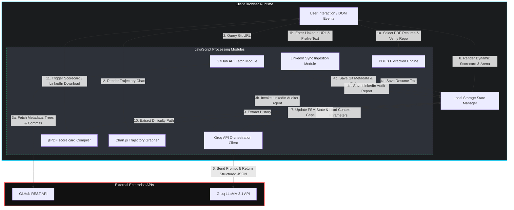
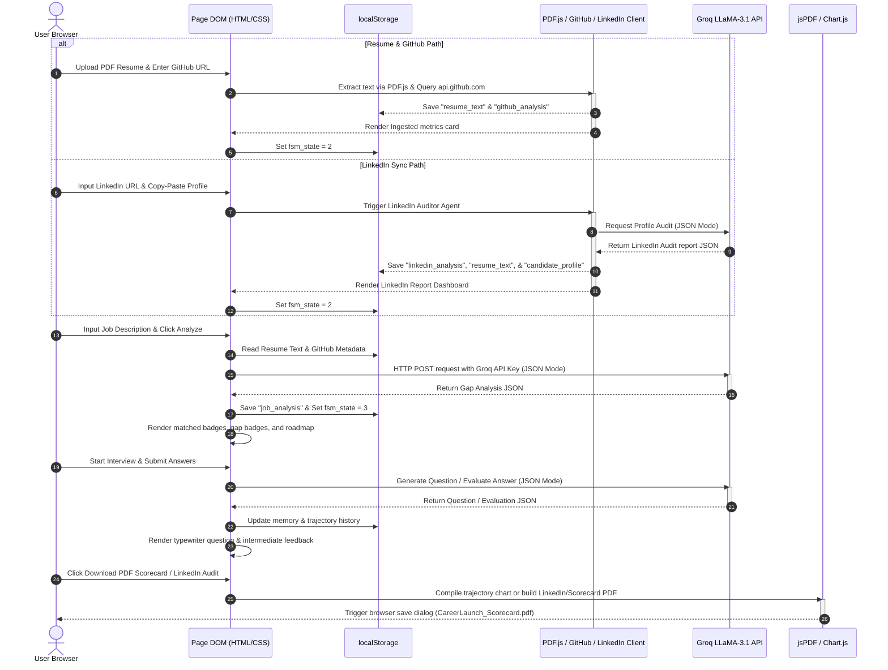

# CareerLaunch AI: System Architecture & Data Flow Specification (Updated V3.0)
**Author:** Principal Solutions Architect  
**Target Audience:** Enterprise Engineering Judges, Lead Developers, Senior Systems Engineers  
**Classification:** Technical Architecture Document (Production-Grade)

---

## SECTION 1: SYSTEM OVERVIEW & ARCHITECTURE STYLE

### 1.1 The Client-Side Serverless Architecture Model
CareerLaunch AI utilizes a **Client-Side Serverless Architecture** model. Unlike traditional multi-tier web applications that require separate backend server nodes or stateful session containers, CareerLaunch AI unifies user interface rendering, data ingestion, AI orchestration, and state management directly inside the user's web browser.

The static frontend assets are served locally using a lightweight Python HTTP server (`python -m http.server 8000`) and executed entirely in the client-side runtime.

```
┌────────────────────────────────────────────────────────────────────────┐
│                        CLIENT BROWSER RUNTIME                          │
│                                                                        │
│  ┌────────────────────────┐            ┌────────────────────────────┐  │
│  │   Tailwind CSS View    │◄──────────►│   Browser ES6 Engines      │  │
│  │   (HTML Presentation)  │            │   (JS Ingestion, LLM call) │  │
│  └────────────────────────┘            └────────────────────────────┘  │
│                                                      ▲                 │
│                                                      │                 │
│                                                      ▼                 │
│                                        ┌────────────────────────────┐  │
│                                        │   Browser localStorage     │  │
│                                        │   (Unified FSM State Repo) │  │
│                                        └────────────────────────────┘  │
└────────────────────────────────────────────────────────────────────────┘
```

The application maintains a strict logical separation of concerns divided into modular client-side layers:
*   **Presentation Layer (HTML5 / Tailwind CSS / Material Symbols):** Static pages (`profile-auditor.html`, `insights.html`, `mock-interview.html`) serving as rendering targets, utilizing dynamic DOM binding.
*   **State Management (Browser localStorage):** Persistent browser database storing the candidate profile, extracted resume text, verified GitHub statistics, Job Description, gap analysis, and the active interview state memory.
*   **Ingestion Engines (PDF.js & GitHub Fetch Client):** Client-side modules executing asynchronous binary parsing (resumes) and API queries (GitHub repositories) directly from the user's browser.
*   **AI Orchestration Layer (Browser Fetch Client):** Asynchronous JavaScript fetch client constructing prompts, handling secure header injection, and communicating directly with Groq LLaMA-3.1.

#### Component Interaction & Lifecycle
The application is governed by a **Finite State Machine (FSM)**. As the candidate uploads documents and runs analyses, the state transitions from State 0 (Empty) to State 3 (Active Interview Room). 

1.  **State Retention:** Global state variables persist in `localStorage` across page navigations, allowing seamless data transfer between the Profile Auditor, Market Insights, and the Mock Interview pages.
2.  **Navigation Locks:** Access to downstream pages is gated by checking `localStorage.getItem('fsm_state')`. If prerequisites are unmet, a glassmorphic warning overlay blocks navigation.

---

### 1.2 Integration Points with External APIs

The system coordinates direct browser-level HTTPS connections to external APIs.

```
                    ┌────────────────────────┐
                    │    CareerLaunch AI     │
                    │   Client Browser App   │
                    └────┬──────────────┬────┘
                         │              │
        HTTPS (REST API) │              │ HTTPS (JSON API CORS)
                         ▼              ▼
               ┌────────────────────┐  ┌────────────────────┐
               │  GitHub REST API   │  │  Groq / LLaMA-3.1  │
               │  (Public Repos)    │  │  (LLM Provider)    │
               └────────────────────┘  └────────────────────┘
```

#### 1. GitHub REST API Integration
*   **Communications Protocol:** HTTPS REST endpoints over TLS 1.3 fetched directly from the browser.
*   **Access Scope:** Fetches repository metadata (`/repos/{owner}/{repo}`), directory structures (`/contents`), and commit logs (`/commits`).
*   **Resiliency:** Automatically falls back to a realistic local mockup payload if requests are blocked or rate-limited.

#### 2. Groq LLaMA-3.1 API Integration
*   **Communications Protocol:** HTTPS POST calls requesting `application/json` payloads with CORS authorization.
*   **Model Selection:** Default configuration targets `llama-3.1-8b-instant` via direct JSON mode for sub-second token latency and structured output enforcement.
*   **Security:** API Keys are entered by the user in a collapsible settings panel and stored solely in their browser's local sandbox (`localStorage.getItem('groq_api_key')`).

---

## SECTION 2: MERMAID.JS DIAGRAMS

### 2.1 System Component Block Diagram
This block diagram outlines the boundaries of the client-side system, illustrating how user inputs flow through the logical ingestion layers in the browser to the external APIs, and return as structured data to be formatted into visual components.



---

### 2.2 Data Flow Sequence Diagram
The sequence diagram details the chronological execution flow from the moment the user drops a resume into the browser down to the client-side data gathering, Groq inference, and final PDF generation.



---

## SECTION 3: INGESTION PIPELINES & DATA SCHEMAS

### 3.1 PDF Resume Processing Pipeline
Resume text extraction is executed entirely within the browser sandbox using the **PDF.js** library, avoiding server-side uploads and protecting candidate privacy.

```
 st.file_uploader ──► FileReader ArrayBuffer ──► PDF.js getDocument ──► Page Text Loop ──► localStorage
```

#### Ingestion Walkthrough:
1.  **File Read:** The browser triggers `FileReader.readAsArrayBuffer` on the uploaded PDF file.
2.  **PDF.js Instantiation:** The raw buffer is passed to `pdfjsLib.getDocument()`.
3.  **Text Extraction:** The script iterates page-by-page, calling `page.getTextContent()` to join string tokens into a single text block.
4.  **Local Storage Binding:** The text is saved under `localStorage.setItem('resume_text', extractedText)` and parsed for candidate name/email using regular expressions.

---

### 3.2 GitHub API Data Pipeline
The GitHub pipeline queries the public GitHub API directly from the client browser.

```
 GitHub URL ──► Regex Validation ──► Async Fetch API ──► In-Memory JSON Parsing ──► localStorage
```

1.  **Regex Extraction:** The repository URL is matched against `/github\.com\/([A-Za-z0-9_.-]+)\/([A-Za-z0-9_.-]+)/` to isolate the `owner` and `repo` names.
2.  **Metadata Request:** Query `https://api.github.com/repos/${owner}/${repo}` to fetch star count, primary programming language, and description.
3.  **Commit History Request:** Query `/commits?per_page=10` to get commit messages, SHA, and timestamps.
4.  **Data Binding:** Combines metadata and commit history into a single object, calculating a repository health score and verified skills dynamically before committing to `localStorage`.

---

### 3.3 LinkedIn Sync Ingestion Pipeline
The LinkedIn pipeline handles profile auditing directly inside the browser using the LLM-driven `LinkedInProfileAuditorAgent`.

```
 LinkedIn Profile Details ──► Groq Completion Client (JSON Mode) ──► localStorage
```

1.  **Direct Input:** Candidate enters their LinkedIn URL and copies profile content (About summary, Headline, Work history).
2.  **API Audit:** Prompt the Groq LLaMA-3.1 model to critique profile components (headline SEO keywords, impact statements, completeness) returning a structured JSON response.
3.  **Unified State Mapping:**
    *   Saves overall and category scores to `localStorage.setItem('linkedin_analysis', auditJSON)`.
    *   Saves copied profile text to `localStorage.setItem('resume_text', copiedText)` and extracts skills to update `localStorage.setItem('candidate_profile', candidateProfile)` allowing downstream Compatibility matching to work seamlessly.
    *   Sets `fsm_state = 2`.

---

## SECTION 4: STATE MANAGEMENT SCHEMA

All application state variables are preserved inside `localStorage` to allow decoupled views to operate as a single coordinated environment:

*   `fsm_state`: Integer (0 to 3) representing the FSM state.
*   `resume_text`: String containing the normalized text of the candidate's resume or pasted LinkedIn details.
*   `candidate_profile`: JSON object storing candidate contact information, education, parsed skills, and verified badges.
*   `github_analysis`: JSON object containing repository metadata, stars, language focus, file structure, commit history, and computed repo score.
*   `linkedin_analysis`: JSON object containing LinkedIn profile audit scores, critiques, checklists, and extracted skills.
*   `linkedin_url`: String containing the candidate's verified LinkedIn profile link.
*   `job_analysis`: JSON object containing the target job description, compatibility match score, lists of matched vs. gap skills, and bridges roadmap resource recommendations.
*   `groq_api_key`: Secret string containing the user's Groq authorization key.

---

## SECTION 5: SECURITY, AUDITING, & PERFORMANCE

### 5.1 Zero-Persistence & Data Privacy
*   **Sandboxed Environment:** Candidate data (PDF files, GitHub metadata, API tokens) exists solely inside the local browser storage or container memory.
*   **No Central Database:** There are no backend database servers, disk caching nodes, or session logs.
*   **CORS & Transit Encryption:** Direct API requests to GitHub and Groq are forced through HTTPS connections over TLS 1.3, maintaining browser-level transit security.
*   **Clean Reset:** Clicking "Log Out" or clearing browser data immediately wipes all credentials and candidate data from the local sandbox.

---

### 5.2 Secret Management
Auth credentials (specifically the Groq API Key) are entered by the user in a secure, masked password field. The key is stored solely in their browser's sandboxed local storage, preventing server-side exposure or leaking via source control.
