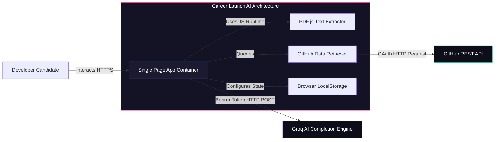
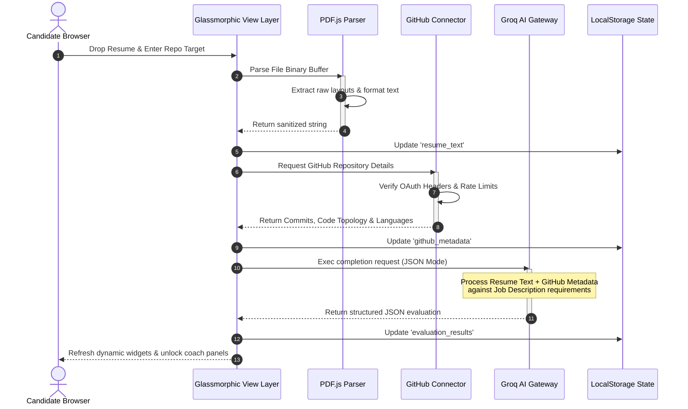
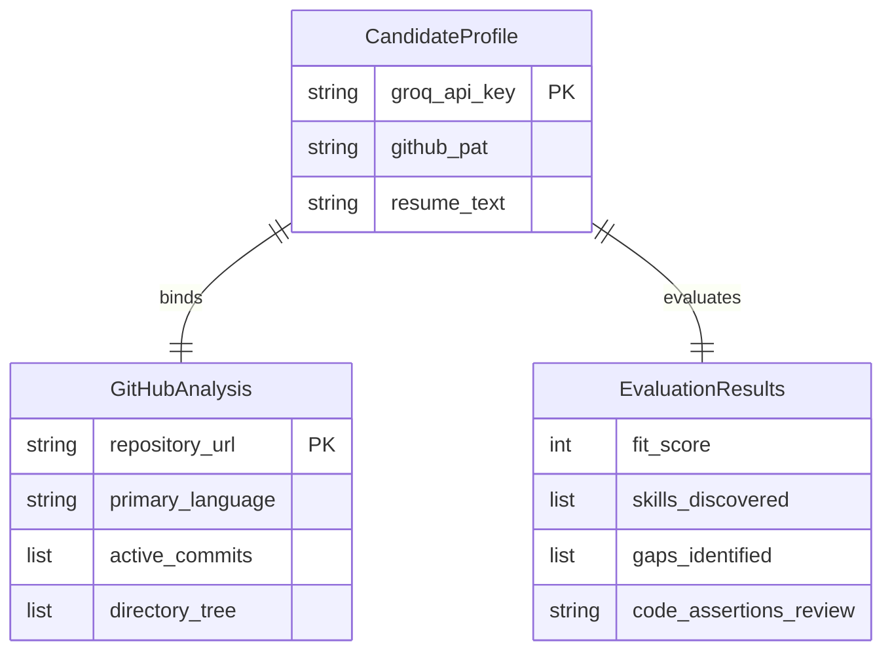
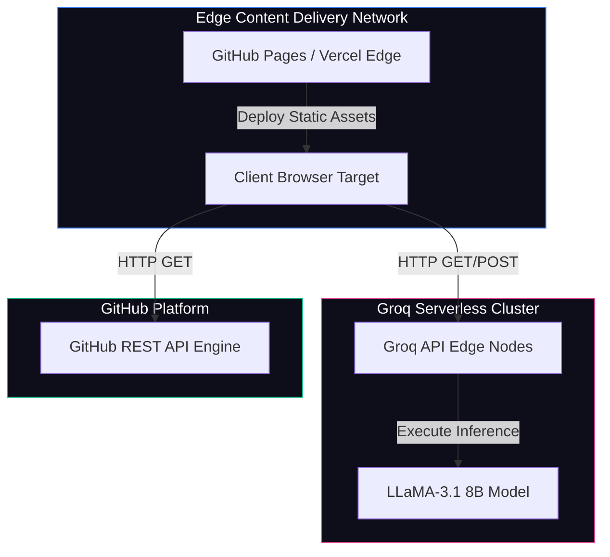
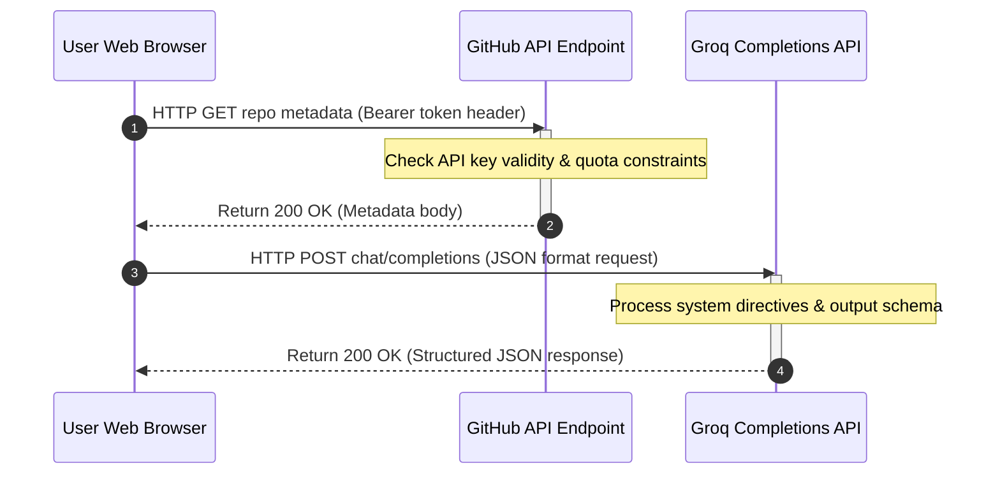
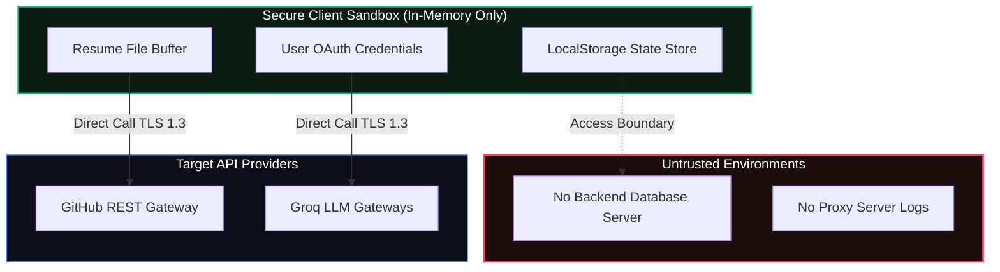
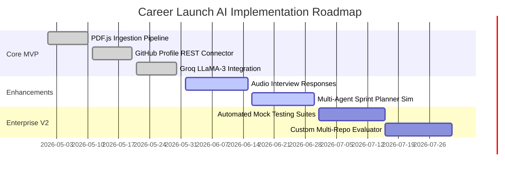
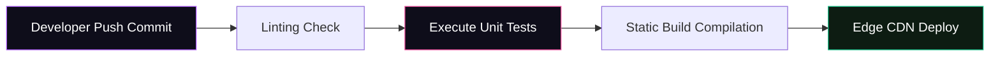

<!-- HERO SECTION START -->
<div align="center">

<!-- Centered Animated SVG Logo with Dynamic CSS Keyframes -->
<svg xmlns="http://www.w3.org/2000/svg" viewBox="0 0 800 240" width="100%" max-width="650" height="auto">
  <style>
    @keyframes pulseGlow {
      0% { filter: drop-shadow(0 0 10px rgba(168, 85, 247, 0.4)) drop-shadow(0 0 20px rgba(236, 72, 153, 0.2)); }
      50% { filter: drop-shadow(0 0 25px rgba(168, 85, 247, 0.8)) drop-shadow(0 0 35px rgba(236, 72, 153, 0.5)); }
      100% { filter: drop-shadow(0 0 10px rgba(168, 85, 247, 0.4)) drop-shadow(0 0 20px rgba(236, 72, 153, 0.2)); }
    }
    @keyframes orbitClockwise {
      from { transform: rotate(0deg); }
      to { transform: rotate(360deg); }
    }
    @keyframes orbitCounterClockwise {
      from { transform: rotate(360deg); }
      to { transform: rotate(0deg); }
    }
    @keyframes dashFlow {
      to { stroke-dashoffset: -40; }
    }
    @keyframes waveFloat {
      0% { transform: translateY(0px); }
      50% { transform: translateY(-8px); }
      100% { transform: translateY(0px); }
    }
    .glowing-bg {
      animation: pulseGlow 4s ease-in-out infinite;
    }
    .orbit-outer {
      transform-origin: 110px 120px;
      animation: orbitClockwise 25s linear infinite;
    }
    .orbit-inner {
      transform-origin: 110px 120px;
      animation: orbitCounterClockwise 15s linear infinite;
    }
    .flow-line {
      stroke-dasharray: 8, 12;
      animation: dashFlow 2s linear infinite;
    }
    .text-title {
      font-family: 'Inter', system-ui, sans-serif;
      font-weight: 900;
      font-size: 46px;
      letter-spacing: 2px;
      fill: #ffffff;
    }
    .text-accent {
      font-family: 'Inter', system-ui, sans-serif;
      font-weight: 900;
      font-size: 46px;
      letter-spacing: 2px;
      fill: url(#blueTealGrad);
    }
    .text-subtitle {
      font-family: 'Inter', system-ui, sans-serif;
      font-weight: 600;
      font-size: 14px;
      letter-spacing: 5px;
      fill: #a8a3c9;
      opacity: 0.85;
    }
  </style>

  <defs>
    <linearGradient id="purplePinkGrad" x1="0%" y1="0%" x2="100%" y2="100%">
      <stop offset="0%" style="stop-color:#a855f7;stop-opacity:1" />
      <stop offset="50%" style="stop-color:#d946ef;stop-opacity:1" />
      <stop offset="100%" style="stop-color:#ec4899;stop-opacity:1" />
    </linearGradient>
    <linearGradient id="blueTealGrad" x1="0%" y1="0%" x2="100%" y2="100%">
      <stop offset="0%" style="stop-color:#3b82f6;stop-opacity:1" />
      <stop offset="100%" style="stop-color:#06b6d4;stop-opacity:1" />
    </linearGradient>
  </defs>

  <!-- Dark Atmospheric Panel -->
  <rect x="10" y="10" width="780" height="220" rx="28" fill="#08070f" stroke="#251b3d" stroke-width="1.5" />

  <!-- Animated Orbiting Core Graphic -->
  <g class="glowing-bg">
    <!-- Inner glowing circle -->
    <circle cx="110" cy="120" r="38" fill="url(#purplePinkGrad)" />
    <!-- Triangle Logo -->
    <path d="M96 136 L110 102 L124 136 Z" fill="none" stroke="#ffffff" stroke-width="6" stroke-linejoin="round" />
    <circle cx="110" cy="113" r="4.5" fill="#ffffff" />
  </g>

  <!-- Outer Orbit Track -->
  <circle cx="110" cy="120" r="56" fill="none" stroke="rgba(168,85,247,0.15)" stroke-width="1.5" />
  <g class="orbit-outer">
    <circle cx="110" cy="64" r="6" fill="#3b82f6" />
    <circle cx="110" cy="176" r="4" fill="#06b6d4" />
  </g>

  <!-- Inner Orbit Track -->
  <circle cx="110" cy="120" r="46" fill="none" stroke="rgba(236,72,153,0.15)" stroke-dasharray="4, 6" stroke-width="1" />
  <g class="orbit-inner">
    <circle cx="64" cy="120" r="4" fill="#ec4899" />
    <circle cx="156" cy="120" r="4" fill="#a855f7" />
  </g>

  <!-- Title / Logo Typography -->
  <text x="195" y="115" class="text-title">CAREERLAUNCH</text>
  <text x="568" y="115" class="text-accent">AI</text>
  
  <!-- Dynamic Subheading -->
  <text x="198" y="152" class="text-subtitle">THE END-TO-END JOB READINESS SUITE</text>

  <!-- Dynamic Flow Dots decoration -->
  <line x1="198" y1="180" x2="730" y2="180" stroke="rgba(255,255,255,0.08)" stroke-width="2" />
  <line x1="198" y1="180" x2="730" y2="180" class="flow-line" stroke="url(#purplePinkGrad)" stroke-width="2" stroke-linecap="round" />
</svg>

<br/>

<!-- Premium Cinematic Animated Banner GIF -->


<br/>
<br/>

<!-- Badge Grid Layout -->
<p align="center">
  <a href="https://github.com/ChiragSharma-DEV/AI-FOR-IMPACT">
    
  </a>
  <a href="https://github.com/ChiragSharma-DEV/AI-FOR-IMPACT">
    
  </a>
  <a href="https://github.com/ChiragSharma-DEV/AI-FOR-IMPACT/blob/main/LICENSE">
    
  </a>
  <a href="https://github.com/ChiragSharma-DEV/AI-FOR-IMPACT">
    
  </a>
  <a href="https://github.com/ChiragSharma-DEV/AI-FOR-IMPACT/stargazers">
    
  </a>
</p>

</div>
<!-- HERO SECTION END -->

<!-- ANIMATED SVG DIVIDER -->
<div align="center" style="margin: 30px 0;">
  <svg xmlns="http://www.w3.org/2000/svg" viewBox="0 0 1440 100" width="100%" height="auto">
    <style>
      @keyframes waveAnimation {
        0% { stroke-dashoffset: 0; }
        100% { stroke-dashoffset: -120; }
      }
      .anim-wave {
        stroke-dasharray: 60, 60;
        animation: waveAnimation 6s linear infinite;
      }
    </style>
    <path fill="none" stroke="rgba(168, 85, 247, 0.15)" stroke-width="4" d="M0,50 C360,100 720,0 1080,50 C1200,67 1320,67 1440,50" />
    <path class="anim-wave" fill="none" stroke="url(#purplePinkGrad)" stroke-width="4" stroke-linecap="round" d="M0,50 C360,100 720,0 1080,50 C1200,67 1320,67 1440,50" />
  </svg>
</div>

---

## 🏛️ High-Fidelity Animated Data Flow

This interactive diagram demonstrates how data packages move and process client-side in Career Launch AI.

<div align="center">
<svg xmlns="http://www.w3.org/2000/svg" viewBox="0 0 800 320" width="100%" max-width="700" height="auto">
  <style>
    @keyframes pulseNode {
      0%, 100% { filter: drop-shadow(0 0 2px rgba(168,85,247,0.4)); r: 8; }
      50% { filter: drop-shadow(0 0 12px rgba(168,85,247,0.9)); r: 11; }
    }
    @keyframes activeLine {
      to { stroke-dashoffset: -40; }
    }
    .pulse-node {
      animation: pulseNode 3s infinite ease-in-out;
      fill: #d946ef;
    }
    .flow-active {
      stroke-dasharray: 6, 12;
      animation: activeLine 1.5s linear infinite;
    }
    .node-box {
      fill: #0e0d1a;
      stroke: rgba(255,255,255,0.08);
      stroke-width: 2;
      transition: all 0.3s;
    }
    .node-box:hover {
      stroke: #a855f7;
    }
    .text-lbl {
      font-family: 'Inter', sans-serif;
      font-size: 13px;
      fill: #f0eeff;
      font-weight: 600;
    }
    .text-desc {
      font-family: 'Inter', sans-serif;
      font-size: 11px;
      fill: #a8a3c9;
    }
  </style>

  <!-- Flow Lines (Static Shadows) -->
  <path d="M180,90 L380,160 M180,230 L380,160 M380,160 L620,90 M380,160 L620,230" stroke="rgba(255,255,255,0.05)" stroke-width="4" fill="none" />
  
  <!-- Flow Lines (Animated) -->
  <path d="M180,90 L380,160" class="flow-active" stroke="url(#purplePinkGrad)" stroke-width="3.5" fill="none" />
  <path d="M180,230 L380,160" class="flow-active" stroke="url(#blueTealGrad)" stroke-width="3.5" fill="none" />
  <path d="M380,160 L620,90" class="flow-active" stroke="url(#purplePinkGrad)" stroke-width="3.5" fill="none" />
  <path d="M380,160 L620,230" class="flow-active" stroke="url(#blueTealGrad)" stroke-width="3.5" fill="none" />

  <!-- Node 1: PDF Resume Ingest -->
  <rect x="20" y="50" width="160" height="70" rx="14" class="node-box" />
  <text x="35" y="80" class="text-lbl">📄 Resume Ingest</text>
  <text x="35" y="100" class="text-desc">PDF.js layout extraction</text>

  <!-- Node 2: Github Auditor -->
  <rect x="20" y="195" width="160" height="70" rx="14" class="node-box" />
  <text x="35" y="225" class="text-lbl">💻 GitHub REST</text>
  <text x="35" y="245" class="text-desc">Verify commit records</text>

  <!-- Core AI Node (Orchestrator) -->
  <circle cx="380" cy="160" r="8" class="pulse-node" />
  <circle cx="380" cy="160" r="28" fill="none" stroke="url(#purplePinkGrad)" stroke-width="2.5" />
  <text x="345" y="210" class="text-lbl">Groq Core</text>
  <text x="325" y="228" class="text-desc">LLaMA-3.1 Evaluation</text>

  <!-- Node 3: Dashboard Analytics -->
  <rect x="620" y="50" width="160" height="70" rx="14" class="node-box" />
  <text x="635" y="80" class="text-lbl">📊 Insights View</text>
  <text x="635" y="100" class="text-desc">Match levels & gaps</text>

  <!-- Node 4: Interview Coach -->
  <rect x="620" y="195" width="160" height="70" rx="14" class="node-box" />
  <text x="635" y="225" class="text-lbl">🎙️ Interview Coach</text>
  <text x="635" y="245" class="text-desc">Llama-3 Interactive Chat</text>
</svg>
</div>

---

## 🏛️ System & Container Architecture

### C4 Container Diagram
This illustrates the interaction routes and protocols used inside Career Launch AI:



### Chronological Ingestion & Analysis Sequence


### State Store & Local Database Entities


### Deployment Topology


---

## 🕹️ Core Modules & Features

<div align="center">

| 📄 **Profile Auditor** | 💻 **GitHub Connector** | 🎙️ **AI Interview Coach** |
| :--- | :--- | :--- |
| Uses **PDF.js** directly inside the browser sandbox to parse binary layouts, strip control codes, and isolate clean candidate texts without server upload lags. | Queries public repositories via REST to check stars, file schemas, language splits, and commit frequency. | Runs live mock technical chats with LLaMA-3.1, providing detailed feedback on conceptual answers. |
| **Ingestion Flow:** <br> `PDF -> [PDF.js] -> Clean Text -> State` | **Audit Flow:** <br> `Repo -> [REST API] -> Code Signature` | **Execution Flow:** <br> `Q & A -> [LLaMA-3] -> Gap Score` |
|  |  |  |

<br/>

| 📊 **Insights Dashboard** | 🎯 **Team Sprint Simulator** | ⌨️ **Omni Command Palette** |
| :--- | :--- | :--- |
| Maps resume skills against target job description requirements, highlighting matches and high-priority gaps. | Simulates an agile Scrum sprint, modeling technical task allocation across diverse developer personas. | Access global application state, run feature triggers, and search documentation instantly using `Ctrl+K`. |
| **Dashboard Flow:** <br> `Text Analysis -> [Match Matrix] -> Chart` | **Simulation Flow:** <br> `Sprint -> [AI Agents] -> Task Allocation` | **Interface Flow:** <br> `Ctrl+K -> [Dynamic Search] -> Route` |
|  |  |  |

</div>

---

## 📂 Repository Directory Layout

```
career-launch-ai/
├── DOC/                             # Architect specifications & planning documents
│   ├── system_architecture_spec.md  # Detailed data flow & rate limit specification
│   ├── tech_stack_api_spec.md       # Integration blueprints for Groq & GitHub APIs
│   └── prd_mvp_v1.md                # Functional specifications & roadmap phases
├── stitch_frontend/
│   └── app/                         # Frontend client codebase
│       ├── index.html               # Main router & auto-redirect gateway
│       ├── insights.html            # Profile analyzer & match dashboard
│       ├── mock-interview.html      # Technical interview simulator
│       ├── profile-auditor.html     # Resume ingestion & verification engine
│       ├── team-planner.html        # Agile sprint emulator
│       ├── command-palette.html     # Omni search navigation panel
│       ├── auth.js                  # Secret validation & configuration module
│       └── theme.css                # Visual style guide & glassmorphic tokens
├── li_script.js                     # Platform background operations parser
├── .gitignore                       # Repository exclusion rules
└── README.md                        # Project technical manual
```

---

## ⚡ API Architecture & Lifecycle

The lifecycle of external requests is direct, moving from the client's browser sandbox to external API servers over secure HTTP connections.

### API Request Lifecycles


### Endpoint Registry

| Service | Target Route | Method | Header Keys | Payload Format |
| :--- | :--- | :--- | :--- | :--- |
| **GitHub REST** | `/repos/{owner}/{repo}` | `GET` | `Authorization: token <pat>` | Query params / JSON |
| **GitHub Commits** | `/repos/{owner}/{repo}/commits` | `GET` | `Authorization: token <pat>` | Query params / JSON |
| **Groq Engine** | `/openai/v1/chat/completions` | `POST` | `Authorization: Bearer <key>` | Structured JSON |

---

## 🔒 Security & Performance Model

### Zero-Persistence Privacy Model



### Performance Metrics & Token Flow
By executing client-side, the app scales with zero cloud server overhead and minimal startup lag:

*   **Document Ingestion (PDF.js)**: Reads, cleans, and outputs text in `< 350ms`.
*   **Groq API Completion Generation**: LLaMA-3.1 generates a full assessment in `< 1.2s`.
*   **Edge CDN Load Time**: Static UI components load in `< 500ms` globally.

---

## 🛠️ Local Installation & Setup

### 1. Clone the repository
```bash
git clone https://github.com/ChiragSharma-DEV/AI-FOR-IMPACT.git
cd AI-FOR-IMPACT
```

### 2. Configure Credentials
Because Career Launch AI runs entirely in your browser sandbox, credentials are saved securely in your browser's local storage and are never sent to external servers.

You can configure these directly in the application's developer settings panel, or preset them in your local debug environment by adding them to your browser's localStorage console:

```javascript
// Open your browser console (F12) on localhost and run:
localStorage.setItem('groq_api_key', 'gsk_YOUR_GROQ_API_KEY_HERE');
localStorage.setItem('github_pat', 'ghp_YOUR_GITHUB_PERSONAL_ACCESS_TOKEN_HERE');
```

### 3. Run Locally
Start a lightweight web server to load the pages. You can use any static server, such as `python` or `http-server`:

```bash
# Using Python
cd stitch_frontend/app
python -m http.server 8080

# Using Node.js
npx http-server -p 8080
```
Visit `http://localhost:8080` in your web browser.

---

## 🗺️ Project Timeline & CI/CD Pipeline

### 1. Gantt Implementation Roadmap


### 2. CI/CD Pipeline Flow


---

## 🤝 Contribution Strategy & Branch Workflow

```mermaid
graph LR
    Fork[Fork Repository] --> Branch[Create Feature Branch]
    Branch --> Code[Implement Feature]
    Code --> Test[Run Local Tests]
    Test --> PullRequest[Open Pull Request]
    PullRequest --> Review[Maintainer Code Review]
    Review --> Merge[Merge to Main]

    style Fork fill:#0e0d1a,stroke:#a855f7,color:#fff
    style PullRequest fill:#0e0d1a,stroke:#ec4899,color:#fff
    style Merge fill:#0d1c12,stroke:#10b981,color:#fff
```



---

## 📄 License & Credits

*   Distributed under the **MIT License**. For details, review [LICENSE](file:///e:/HACKATHON/AI%20FOR%20IMPACT/LICENSE) (if available).
*   **PDF.js** is maintained by the Mozilla Foundation.
*   **Groq API** and **LLaMA-3** are powered by Groq Cloud and Meta respectively.
*   Designed with inspiration from glassmorphic design languages.

---
<div align="center">
  <sub>Developed by elite minds, built for future builders. Powered by Career Launch AI.</sub>
</div>
