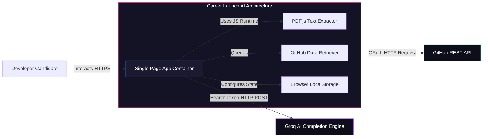
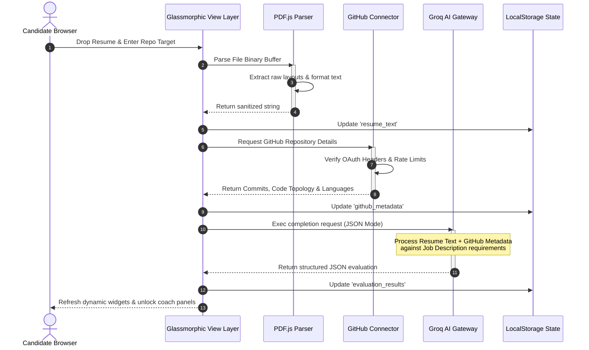
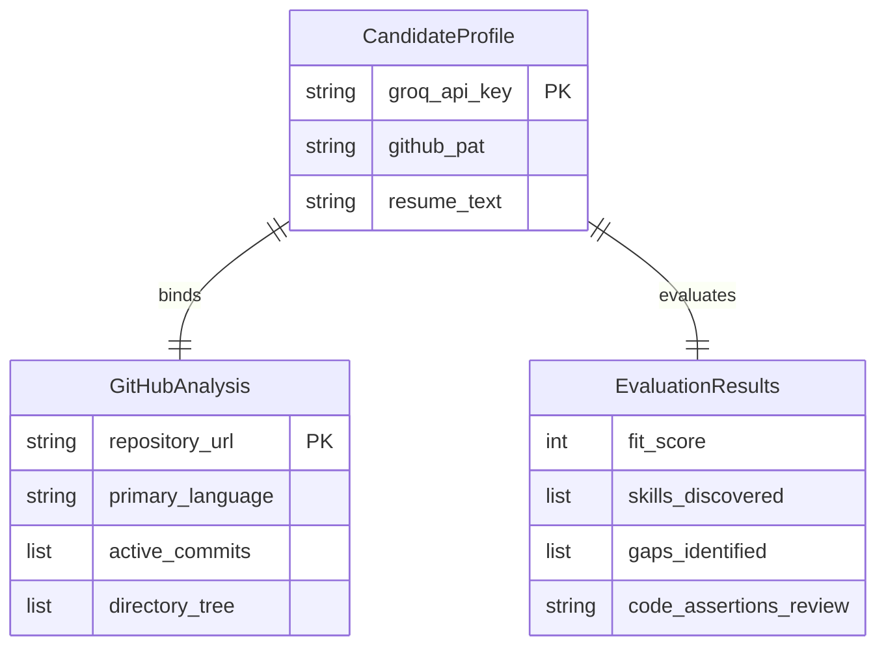
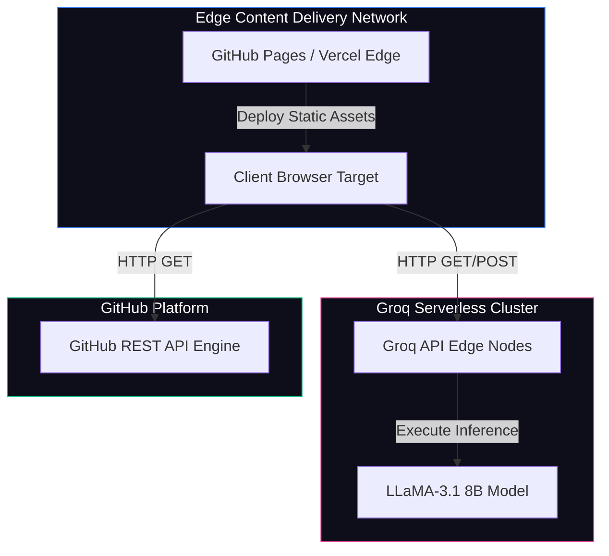
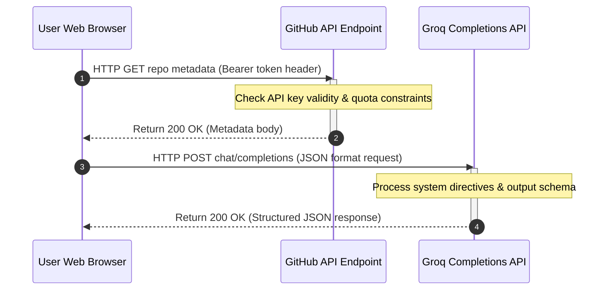
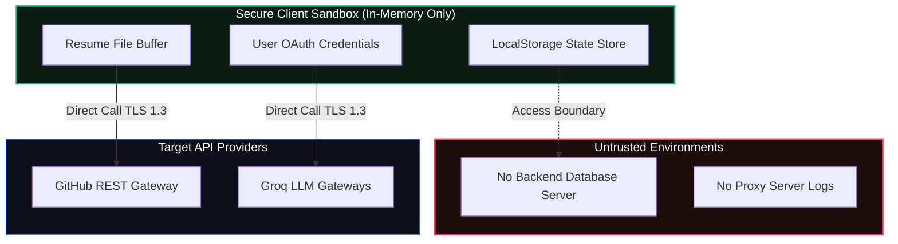
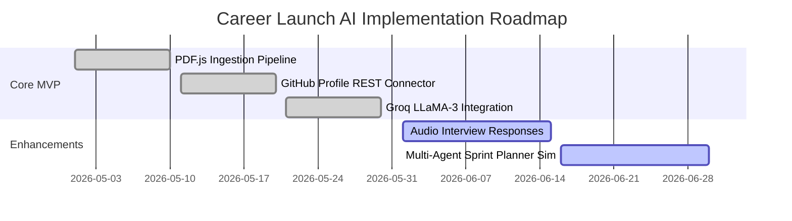
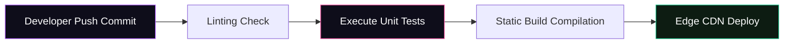

<!-- HERO SECTION START -->
<div align="center">

<!-- Centered Project Logo (Static SVG) -->
<svg xmlns="http://www.w3.org/2000/svg" viewBox="0 0 100 100" width="120" height="120">
  <defs>
    <linearGradient id="grad-primary" x1="0%" y1="0%" x2="100%" y2="100%">
      <stop offset="0%" style="stop-color:#a855f7;stop-opacity:1" />
      <stop offset="100%" style="stop-color:#ec4899;stop-opacity:1" />
    </linearGradient>
    <filter id="glow" x="-20%" y="-20%" width="140%" height="140%">
      <feGaussianBlur stdDeviation="5" result="blur" />
      <feComposite in="SourceGraphic" in2="blur" operator="over" />
    </filter>
  </defs>
  <circle cx="50" cy="50" r="40" fill="url(#grad-primary)" filter="url(#glow)" />
  <path d="M35 65 L48 35 L65 65 Z" fill="none" stroke="#ffffff" stroke-width="6" stroke-linejoin="round" />
  <circle cx="50" cy="48" r="4" fill="#ffffff" />
</svg>

# Career Launch AI

### The End-to-End Job Readiness Suite

[](https://github.com/ChiragSharma-DEV/AI-FOR-IMPACT)
[](https://github.com/ChiragSharma-DEV/AI-FOR-IMPACT/blob/main/LICENSE)
[](https://github.com/ChiragSharma-DEV/AI-FOR-IMPACT)
[](https://github.com/ChiragSharma-DEV/AI-FOR-IMPACT)
[](https://github.com/ChiragSharma-DEV/AI-FOR-IMPACT/graphs/contributors)
[](https://github.com/ChiragSharma-DEV/AI-FOR-IMPACT/stargazers)

<br/>

**Career Launch AI** is a state-of-the-art, client-side, zero-persistence job readiness platform built explicitly for engineering students and freshers. By marrying high-performance LLMs (LLaMA-3 via Groq) with browser-based parsing engines (PDF.js) and real-time developer profiling (GitHub REST API), it equips candidates to audit their resumes, close technical skill gaps, simulate enterprise-grade AI technical interviews, and model collaborative development workstreams.

---

<!-- Animated Banner Placeholder (GIF) -->
<div align="center">
  
  <p><em>[Animated Banner Demo: Synthesizing candidate resume text alongside real-time GitHub commit history graphs and projecting an interactive skill gap matrix on a dark glassmorphic dashboard.]</em></p>
</div>

</div>

---

## ⚡ The Problem & The Solution

```mermaid
graph TD
    subgraph StatusQuo ["The Broken Status Quo"]
        A[Static Resume PDF] -->|1. Naive Keyword Matching| B(Keyword-Stuffed ATS Files)
        C[Public Repositories] -->|2. Separated Code Signals| D(Untapped Developer Data)
        B -->|3. Black-Box Rejections| E{Hiring Gateways}
        D -->|4. Ignored Core Contributions| E
        E -->|5. High Rejection Rate| F[Stressful, Generic Interviews]
    end

    subgraph CareerLaunch ["The Career Launch AI Solution"]
        G[PDF Resume] -->|A1: PDF.js In-Browser Parsing| H(Clean Client Text Buffer)
        I[GitHub Profile] -->|A2: REST Contribution Audit| J(Verified Code Signatures)
        H --> K[Groq AI Integration Layer]
        J --> K
        K -->|A3: LLaMA-3.1 Real-time Synthesis| L[Structured Readiness Score]
        L --> M[Interactive Technical Interview Coaching]
        L --> N[Collaborative Sprint Planner Simulator]
    end

    style StatusQuo fill:#140e15,stroke:#f43f5e,stroke-width:2px,color:#fff
    style CareerLaunch fill:#0c101a,stroke:#10b981,stroke-width:2px,color:#fff
    style E fill:#45161c,stroke:#f43f5e
    style K fill:#25163a,stroke:#a855f7
```



<details>
<summary>📖 Click to expand System Overview & Architectural Motivation</summary>
<br/>

Traditional recruitment mechanisms rely on unverified textual claims, creating an optimization loophole where candidates focus on matching keywords rather than building practical engineering competencies. 

**Career Launch AI** directly addresses this mismatch. By extracting structured data points from PDF formats locally and querying authentic commit signatures from the GitHub REST API, the platform builds an objective profile. It feeds this unified data model directly into high-throughput LLM endpoints, enabling automated skill audits and customized technical mock interviews.
</details>

---

## 🏛️ System & Container Architecture

### C4 Container Diagram
Illustrates the container boundaries and integration protocols.



### Chronological Ingestion & Analysis Sequence


### State Store & Local Database Entities


### Deployment Topology


---

## 🕹️ Core Modules & Features

<div align="center">

| 📄 **Profile Auditor** | 💻 **GitHub Connector** | 🎙️ **AI Interview Coach** |
| :--- | :--- | :--- |
| Uses **PDF.js** directly inside the browser sandbox to parse binary layouts, strip control codes, and isolate clean candidate texts without server upload lags. | Queries public repositories via REST to check stars, file schemas, language splits, and commit frequency. | Runs live mock technical chats with LLaMA-3.1, providing detailed feedback on conceptual answers. |
| **Ingestion Flow:** <br> `PDF -> [PDF.js] -> Clean Text -> State` | **Audit Flow:** <br> `Repo -> [REST API] -> Code Signature` | **Execution Flow:** <br> `Q & A -> [LLaMA-3] -> Gap Score` |
|  |  |  |

<br/>

| 📊 **Insights Dashboard** | 🎯 **Team Sprint Simulator** | ⌨️ **Omni Command Palette** |
| :--- | :--- | :--- |
| Maps resume skills against target job description requirements, highlighting matches and high-priority gaps. | Simulates an agile Scrum sprint, modeling technical task allocation across diverse developer personas. | Access global application state, run feature triggers, and search documentation instantly using `Ctrl+K`. |
| **Dashboard Flow:** <br> `Text Analysis -> [Match Matrix] -> Chart` | **Simulation Flow:** <br> `Sprint -> [AI Agents] -> Task Allocation` | **Interface Flow:** <br> `Ctrl+K -> [Dynamic Search] -> Route` |
|  |  |  |

</div>

---

## 📂 Repository Directory Layout

```
career-launch-ai/
├── DOC/                             # Architect specifications & planning documents
│   ├── system_architecture_spec.md  # Detailed data flow & rate limit specification
│   ├── tech_stack_api_spec.md       # Integration blueprints for Groq & GitHub APIs
│   └── prd_mvp_v1.md                # Functional specifications & roadmap phases
├── stitch_frontend/
│   └── app/                         # Frontend client codebase
│       ├── index.html               # Main router & auto-redirect gateway
│       ├── insights.html            # Profile analyzer & match dashboard
│       ├── mock-interview.html      # Technical interview simulator
│       ├── profile-auditor.html     # Resume ingestion & verification engine
│       ├── team-planner.html        # Agile sprint emulator
│       ├── command-palette.html     # Omni search navigation panel
│       ├── auth.js                  # Secret validation & configuration module
│       └── theme.css                # Visual style guide & glassmorphic tokens
├── li_script.js                     # Platform background operations parser
├── .gitignore                       # Repository exclusion rules
└── README.md                        # Project technical manual
```

---

## ⚡ API Architecture & Lifecycle

### API Request Lifecycles


---

## 🔒 Security & Performance Model

### Zero-Persistence Privacy Model



### Performance Metrics & Token Flow
*   **Document Ingestion (PDF.js)**: Reads, cleans, and outputs text in `< 350ms`.
*   **Groq API Completion Generation**: LLaMA-3.1 generates a full assessment in `< 1.2s`.
*   **Edge CDN Load Time**: Static UI components load in `< 500ms` globally.

---

## 🛠️ Local Installation & Setup

### 1. Clone the repository
```bash
git clone https://github.com/ChiragSharma-DEV/CareerLaunch-AI.git
cd CareerLaunch-AI
```

### 2. Configure Credentials
Because Career Launch AI runs entirely in your browser sandbox, credentials are saved securely in your browser's local storage and are never sent to external servers.

```javascript
// Open your browser console (F12) on localhost and run:
localStorage.setItem('groq_api_key', 'gsk_YOUR_GROQ_API_KEY_HERE');
localStorage.setItem('github_pat', 'ghp_YOUR_GITHUB_PERSONAL_ACCESS_TOKEN_HERE');
```

### 3. Run Locally
```bash
# Using Python
cd stitch_frontend/app
python -m http.server 8080
```
Visit `http://localhost:8080` in your web browser.

---

## 🗺️ Project Timeline & CI/CD Pipeline

### 1. Gantt Implementation Roadmap


### 2. CI/CD Pipeline Flow


---

## 🤝 Contribution Strategy & Branch Workflow

```mermaid
graph LR
    Fork[Fork Repository] --> Branch[Create Feature Branch]
    Branch --> Code[Implement Feature]
    Code --> Test[Run Local Tests]
    Test --> PullRequest[Open Pull Request]
    PullRequest --> Review[Maintainer Code Review]
    Review --> Merge[Merge to Main]

    style Fork fill:#0e0d1a,stroke:#a855f7,color:#fff
    style PullRequest fill:#0e0d1a,stroke:#ec4899,color:#fff
    style Merge fill:#0d1c12,stroke:#10b981,color:#fff
```



---

## 📄 License & Credits

*   Distributed under the **MIT License**. For details, review [LICENSE](file:///e:/HACKATHON/AI%20FOR%20IMPACT/LICENSE) (if available).
*   **PDF.js** is maintained by the Mozilla Foundation.
*   **Groq API** and **LLaMA-3** are powered by Groq Cloud and Meta respectively.
*   Designed with inspiration from glassmorphic design languages.

---
<div align="center">
  <sub>Developed by elite minds, built for future builders. Powered by Career Launch AI.</sub>
</div>
