<!-- HERO SECTION START -->
<div align="center">

<!-- Custom Dynamic Gradient SVG Logo -->
<svg xmlns="http://www.w3.org/2000/svg" viewBox="0 0 800 220" width="100%" max-width="600" height="auto">
  <defs>
    <linearGradient id="purplePink" x1="0%" y1="0%" x2="100%" y2="100%">
      <stop offset="0%" style="stop-color:#a855f7;stop-opacity:1" />
      <stop offset="50%" style="stop-color:#d946ef;stop-opacity:1" />
      <stop offset="100%" style="stop-color:#ec4899;stop-opacity:1" />
    </linearGradient>
    <linearGradient id="blueTeal" x1="0%" y1="0%" x2="100%" y2="100%">
      <stop offset="0%" style="stop-color:#3b82f6;stop-opacity:1" />
      <stop offset="100%" style="stop-color:#06b6d4;stop-opacity:1" />
    </linearGradient>
    <filter id="neonGlow" x="-20%" y="-20%" width="140%" height="140%">
      <feGaussianBlur stdDeviation="8" result="blur" />
      <feComposite in="SourceGraphic" in2="blur" operator="over" />
    </filter>
  </defs>
  <!-- Background Glow Element -->
  <rect x="10" y="10" width="780" height="200" rx="24" fill="#0e0d1a" stroke="url(#purplePink)" stroke-width="2" />
  
  <!-- Logo Icon -->
  <g transform="translate(45, 50)">
    <circle cx="60" cy="60" r="50" fill="url(#purplePink)" filter="url(#neonGlow)" opacity="0.9" />
    <path d="M35 80 L60 35 L85 80 Z" fill="none" stroke="#ffffff" stroke-width="8" stroke-linejoin="round" stroke-linecap="round" />
    <circle cx="60" cy="58" r="6" fill="#ffffff" />
    <path d="M48 80 L72 80" stroke="#ffffff" stroke-width="4" stroke-linecap="round"/>
  </g>

  <!-- Typography -->
  <text x="190" y="115" font-family="'Inter', 'Segoe UI', sans-serif" font-weight="900" font-size="44" fill="#f0eeff" letter-spacing="2">CAREERLAUNCH</text>
  <text x="560" y="115" font-family="'Inter', 'Segoe UI', sans-serif" font-weight="900" font-size="44" fill="url(#blueTeal)" letter-spacing="2">AI</text>
  <text x="192" y="155" font-family="'Inter', 'Segoe UI', sans-serif" font-weight="500" font-size="16" fill="#a8a3c9" letter-spacing="4">THE END-TO-END JOB READINESS SUITE</text>
</svg>

<br/>

<!-- Animated Showcase Banner -->


<br/>
<br/>

<!-- Modern Badge Row -->
<p align="center">
  
  
  
  
  
</p>

<p align="center">
  <strong>An elite, zero-persistence developer preparation workspace.</strong><br/>
  Synthesizes browser-side document tokenization, GitHub contribution analytics, and LLaMA-3.1 inference gateways<br/>
  to transform candidate portfolios into verified, interview-ready profiles.
</p>

</div>
<!-- HERO SECTION END -->

<!-- SECTION DIVIDER (SVG Gradient Wave) -->
<div align="center">
  <svg xmlns="http://www.w3.org/2000/svg" viewBox="0 0 1440 120" width="100%" height="auto" style="margin: 20px 0;">
    <path fill="none" stroke="url(#purplePink)" stroke-width="2" d="M0,32L120,42.7C240,53,480,75,720,74.7C960,75,1200,53,1320,42.7L1440,32" />
    <path fill="url(#purplePink)" fill-opacity="0.05" d="M0,32L120,42.7C240,53,480,75,720,74.7C960,75,1200,53,1320,42.7L1440,32L1440,120L1320,120C1200,120,960,120,720,120C480,120,240,120,120,120L0,120Z" />
  </svg>
</div>

---

## ⚡ The Problem & The Solution

```mermaid
graph TD
    subgraph StatusQuo ["The Broken Status Quo"]
        A[Static Resume PDF] -->|1. Naive Keyword Matching| B(Keyword-Stuffed ATS Files)
        C[Public Repositories] -->|2. Separated Code Signals| D(Untapped Developer Data)
        B -->|3. Black-Box Rejections| E{Hiring Gateways}
        D -->|4. Ignored Core Contributions| E
        E -->|5. High Rejection Rate| F[Stressful, Generic Interviews]
    end

    subgraph CareerLaunch ["The Career Launch AI Solution"]
        G[PDF Resume] -->|A1: PDF.js In-Browser Parsing| H(Clean Client Text Buffer)
        I[GitHub Profile] -->|A2: REST Contribution Audit| J(Verified Code Signatures)
        H --> K[Groq AI Integration Layer]
        J --> K
        K -->|A3: LLaMA-3.1 Real-time Synthesis| L[Structured Readiness Score]
        L --> M[Interactive Technical Interview Coaching]
        L --> N[Collaborative Sprint Planner Simulator]
    end

    style StatusQuo fill:#140e15,stroke:#f43f5e,stroke-width:2px,color:#fff
    style CareerLaunch fill:#0c101a,stroke:#10b981,stroke-width:2px,color:#fff
    style E fill:#45161c,stroke:#f43f5e
    style K fill:#25163a,stroke:#a855f7
```

<details>
<summary>📖 Click to expand System Overview & Architectural Motivation</summary>
<br/>

Traditional recruitment mechanisms rely on unverified textual claims, creating an optimization loophole where candidates focus on matching keywords rather than building practical engineering competencies. 

**Career Launch AI** directly addresses this mismatch. By extracting structured data points from PDF formats locally and querying authentic commit signatures from the GitHub REST API, the platform builds an objective profile. It feeds this unified data model directly into high-throughput LLM endpoints, enabling automated skill audits and customized technical mock interviews.
</details>

---

## 🏛️ System & Container Architecture

### 1. System Component Block Diagram
This system-level breakdown shows the separation of concerns between client sandboxes and external servers.

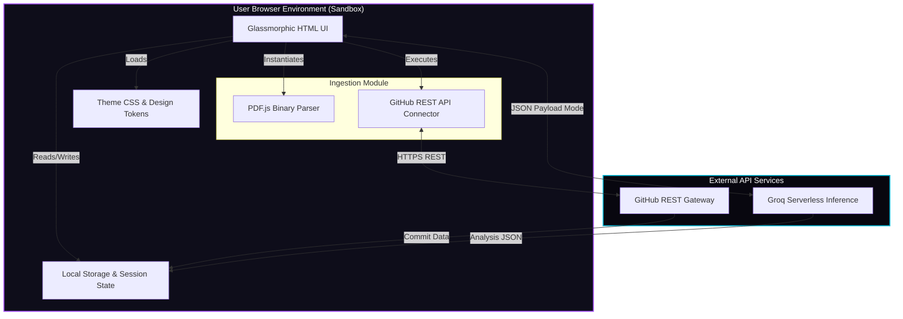

### 2. C4 Container Diagram
Illustrates the container boundaries and integration protocols.

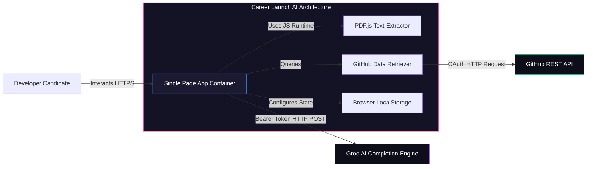

### 3. Chronological Ingestion & Analysis Sequence

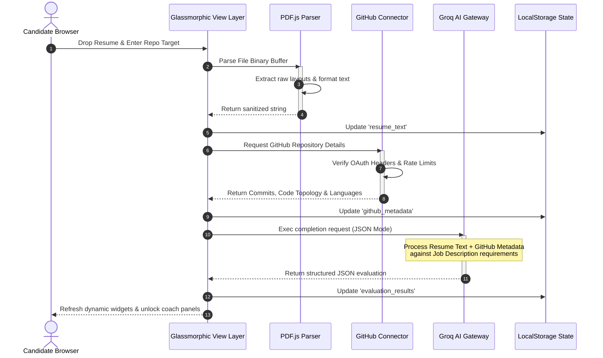

### 4. Logical Database (Local Storage State) Entity-Relationship Model

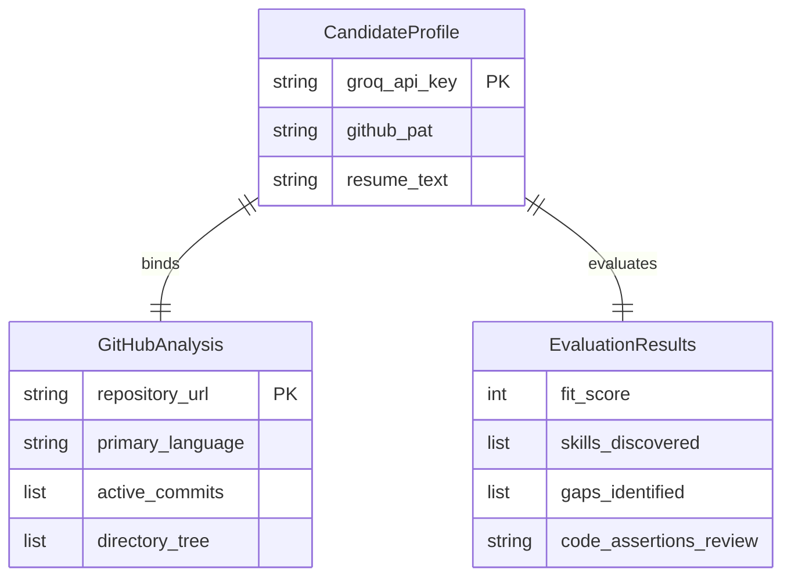

### 5. Deployment Topology

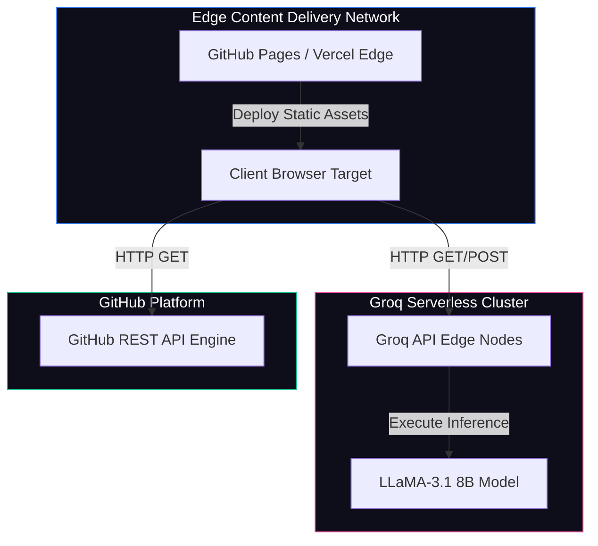

---

## 🕹️ Core Modules & Features

<div align="center">

| 📄 **Profile Auditor** | 💻 **GitHub Connector** | 🎙️ **AI Interview Coach** |
| :--- | :--- | :--- |
| Uses **PDF.js** directly inside the browser sandbox to parse binary layouts, strip control codes, and isolate clean candidate texts without server upload lags. | Queries public repositories via REST to check stars, file schemas, language splits, and commit frequency. | Runs live mock technical chats with LLaMA-3.1, providing detailed feedback on conceptual answers. |
| **Ingestion Flow:** <br> `PDF -> [PDF.js] -> Clean Text -> State` | **Audit Flow:** <br> `Repo -> [REST API] -> Code Signature` | **Execution Flow:** <br> `Q & A -> [LLaMA-3] -> Gap Score` |
|  |  |  |

<br/>

| 📊 **Insights Dashboard** | 🎯 **Team Sprint Simulator** | ⌨️ **Omni Command Palette** |
| :--- | :--- | :--- |
| Maps resume skills against target job description requirements, highlighting matches and high-priority gaps. | Simulates an agile Scrum sprint, modeling technical task allocation across diverse developer personas. | Access global application state, run feature triggers, and search documentation instantly using `Ctrl+K`. |
| **Dashboard Flow:** <br> `Text Analysis -> [Match Matrix] -> Chart` | **Simulation Flow:** <br> `Sprint -> [AI Agents] -> Task Allocation` | **Interface Flow:** <br> `Ctrl+K -> [Dynamic Search] -> Route` |
|  |  |  |

</div>

---

## 📂 Repository Directory Layout

```
career-launch-ai/
├── DOC/                             # Architect specifications & planning documents
│   ├── system_architecture_spec.md  # Detailed data flow & rate limit specification
│   ├── tech_stack_api_spec.md       # Integration blueprints for Groq & GitHub APIs
│   └── prd_mvp_v1.md                # Functional specifications & roadmap phases
├── stitch_frontend/
│   └── app/                         # Frontend client codebase
│       ├── index.html               # Main router & auto-redirect gateway
│       ├── insights.html            # Profile analyzer & match dashboard
│       ├── mock-interview.html      # Technical interview simulator
│       ├── profile-auditor.html     # Resume ingestion & verification engine
│       ├── team-planner.html        # Agile sprint emulator
│       ├── command-palette.html     # Omni search navigation panel
│       ├── auth.js                  # Secret validation & configuration module
│       └── theme.css                # Visual style guide & glassmorphic tokens
├── li_script.js                     # Platform background operations parser
├── .gitignore                       # Repository exclusion rules
└── README.md                        # Project technical manual
```

---

## ⚡ API Architecture & Lifecycle

The lifecycle of external requests is direct, moving from the client's browser sandbox to external API servers over secure HTTP connections.

### API Request Lifecycles
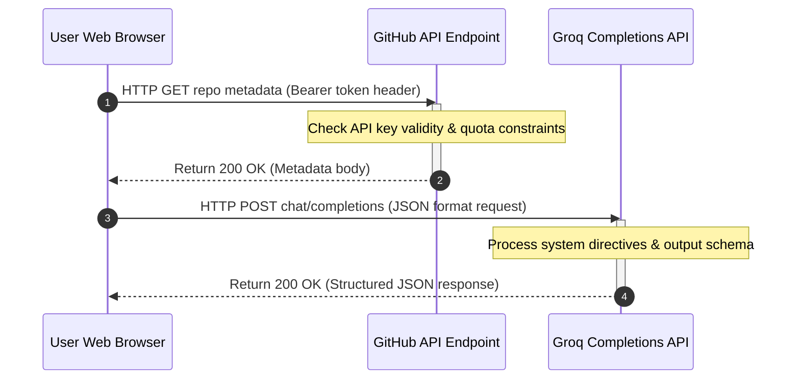

### Endpoint Registry

| Service | Target Route | Method | Header Keys | Payload Format |
| :--- | :--- | :--- | :--- | :--- |
| **GitHub REST** | `/repos/{owner}/{repo}` | `GET` | `Authorization: token <pat>` | Query params / JSON |
| **GitHub Commits** | `/repos/{owner}/{repo}/commits` | `GET` | `Authorization: token <pat>` | Query params / JSON |
| **Groq Engine** | `/openai/v1/chat/completions` | `POST` | `Authorization: Bearer <key>` | Structured JSON |

### Sample Groq Payload (JSON Mode Request)

**Request Payload:**
```json
{
  "model": "llama-3.1-8b-instant",
  "response_format": {
    "type": "json_object"
  },
  "messages": [
    {
      "role": "system",
      "content": "You are an expert technical interviewer. Return evaluation metrics in a valid JSON schema."
    },
    {
      "role": "user",
      "content": "Resume: [Extracted Resume Content] ... Github: [Git Stats] ... Target JD: [Job Description]"
    }
  ]
}
```

**Response Payload:**
```json
{
  "fit_score": 88,
  "skills_discovered": ["JavaScript", "TailwindCSS", "PDF.js"],
  "gaps": [
    {
      "skill": "Docker",
      "reason": "Target JD requests cloud container deployment, but candidate's git history shows no container configuration files.",
      "priority": "HIGH"
    }
  ],
  "project_validation": "Github repository contains commits matching assertions, verifying practical application."
}
```

---

## 🔒 Security & Performance Model

### Zero-Persistence Privacy Model

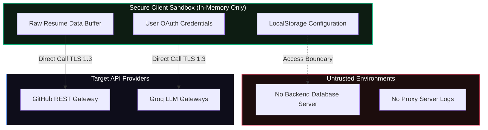

### Performance Metrics & Token Flow
By executing client-side, the app scales with zero cloud server overhead and minimal startup lag:

*   **Document Ingestion (PDF.js)**: Reads, cleans, and outputs text in `< 350ms`.
*   **Groq API Completion Generation**: LLaMA-3.1 generates a full assessment in `< 1.2s`.
*   **Edge CDN Load Time**: Static UI components load in `< 500ms` globally.

---

## 🛠️ Local Installation & Setup

### 1. Clone the repository
```bash
git clone https://github.com/ChiragSharma-DEV/AI-FOR-IMPACT.git
cd AI-FOR-IMPACT
```

### 2. Configure Credentials
Because Career Launch AI runs entirely in your browser sandbox, credentials are saved securely in your browser's local storage and are never sent to external servers.

You can configure these directly in the application's developer settings panel, or preset them in your local debug environment by adding them to your browser's localStorage console:

```javascript
// Open your browser console (F12) on localhost and run:
localStorage.setItem('groq_api_key', 'gsk_YOUR_GROQ_API_KEY_HERE');
localStorage.setItem('github_pat', 'ghp_YOUR_GITHUB_PERSONAL_ACCESS_TOKEN_HERE');
```

### 3. Run Locally
Start a lightweight web server to load the pages. You can use any static server, such as `python` or `http-server`:

```bash
# Using Python
cd stitch_frontend/app
python -m http.server 8080

# Using Node.js
npx http-server -p 8080
```
Visit `http://localhost:8080` in your web browser.

---

## 🗺️ Project Timeline & CI/CD Pipeline

### 1. Gantt Implementation Roadmap
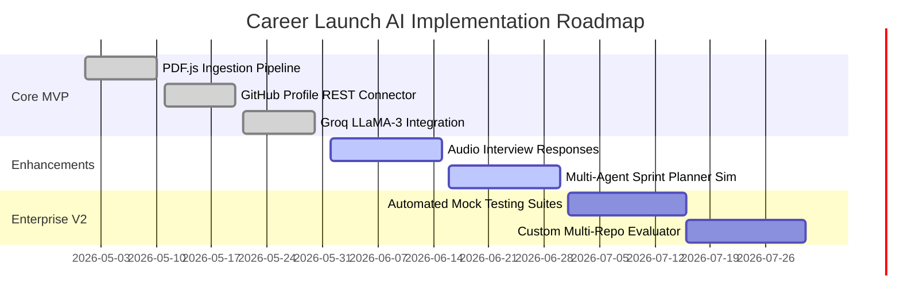

### 2. CI/CD Pipeline Flow
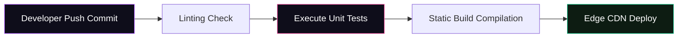

---

## 🤝 Contribution Strategy & Branch Workflow

```mermaid
graph LR
    Fork[Fork Repository] --> Branch[Create Feature Branch]
    Branch --> Code[Implement Feature]
    Code --> Test[Run Local Tests]
    Test --> PullRequest[Open Pull Request]
    PullRequest --> Review[Maintainer Code Review]
    Review --> Merge[Merge to Main]

    style Fork fill:#0e0d1a,stroke:#a855f7,color:#fff
    style PullRequest fill:#0e0d1a,stroke:#ec4899,color:#fff
    style Merge fill:#0d1c12,stroke:#10b981,color:#fff
```

*   **Production Branch**: `main` houses the current production-stable deployment.
*   **Development workflow**: Create a descriptive branch named `feature/your-feature-name` or `bugfix/issue-resolved` and submit a Pull Request targeting `main`.

---

## 📄 License & Credits

*   Distributed under the **MIT License**. For details, review [LICENSE](file:///e:/HACKATHON/AI%20FOR%20IMPACT/LICENSE) (if available).
*   **PDF.js** is maintained by the Mozilla Foundation.
*   **Groq API** and **LLaMA-3** are powered by Groq Cloud and Meta respectively.
*   Designed with inspiration from glassmorphic design languages.

---
<div align="center">
  <sub>Developed by elite minds, built for future builders. Powered by Career Launch AI.</sub>
</div>
